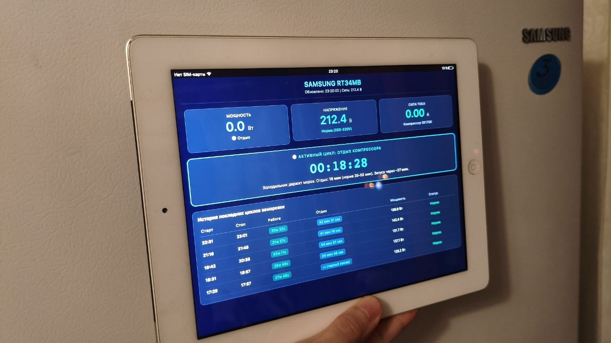
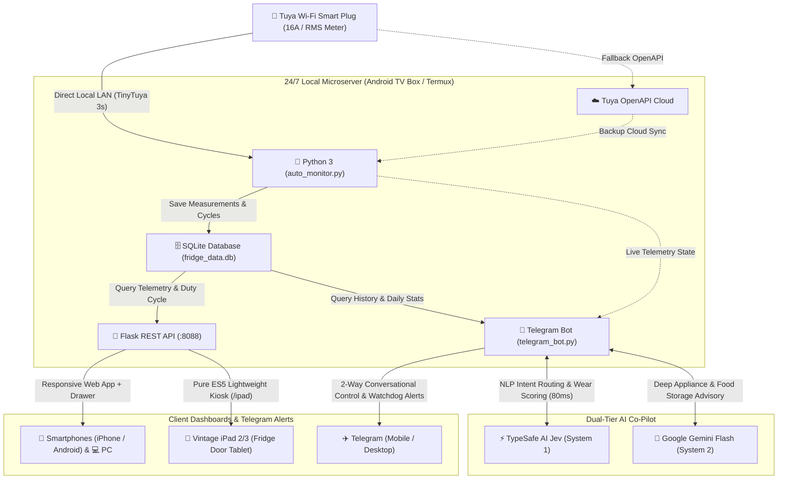

<div align="center">

# 🧊 SmartFridge-Telemetry-Kiosk
### Turn Any Vintage Refrigerator into a Smart IoT Hub for $0 using an Android TV Box, Smart Plug & Retired iPad

<p align="center">
  <b>English</b> • <a href="README.ru.md">Русский</a>
</p>

[](version.py)
[](https://www.python.org/)
[](https://flask.palletsprojects.com/)
[](https://sqlite.org/)
[-success.svg?logo=android)](https://termux.dev/)
[-orange.svg?logo=apple)](https://apple.com)
[-brightgreen.svg)](https://github.com/jasonacox/tinytuya)
[-blueviolet.svg)](https://typesafe.ai)
[](https://aistudio.google.com)
[](https://telegram.org)
[](https://alevoldon.github.io/SmartFridge-Telemetry-Kiosk/)
[](LICENSE)

<br />



*A retired 2012 iPad 3 (Retina Display, iOS 9.3.6, Model MD369KS/A) running an ultra-lightweight ES5 dashboard mounted directly on the refrigerator door, powered by a 24/7 background microserver on an Android TV Box.*

</div>

---

## 📖 Overview

When a repair technician claims that your refrigerator compressor is running excessively due to *"bad grid voltage"*, don't argue with words — **argue with real-time telemetry, thermodynamics, and charts.**

**SmartFridge-Telemetry-Kiosk** is a complete, self-hosted IoT telemetry ecosystem designed to monitor, diagnose, and visualize refrigerator duty cycles in real time. It calculates thermodynamic efficiency ratios ($\text{Duty Cycle} = \frac{T_{work}}{T_{work} + T_{rest}}$), distinguishes between **Compressor Cooling** and **No Frost Defrost Heaters**, and survives power outages with automatic cloud backfill.

### 🌟 Key Highlights

- 🏠 **Dual-Channel LAN Direct Polling (0 Cloud Quota Usage):** Directly reads smart plug sensors via local Wi-Fi network (TinyTuya LAN UDP/TCP) at 3-second intervals with **100% quota savings**, automatically failing over to Tuya Cloud API only if local Wi-Fi drops.
- 🍏 **Second Life for E-Waste (Vintage iPad Kiosk):** Ancient iPads (tested on **iPad 3 Retina iOS 9.3.6**, iPad 2, iPad 4, iPad mini 1-2) that cannot open modern heavy web frameworks run a dedicated, ultra-responsive **pure ES5 / CSS3 table-based dashboard** (`/ipad`) with zero dependencies.
- 🤖 **3-Watt 24/7 Autonomous Microserver:** Runs seamlessly inside **Termux on a $15 Android TV Box (H96 Max / Rockchip RK3318 / Amlogic)**, replacing expensive Raspberry Pi hardware.
- ⚡ **Real-Time Blackout Detection & Emergency Kiosk Mode:** Detects grid power failure within seconds, immediately switching dashboards into high-visibility *"🔴 ЭЛЕКТРИЧЕСТВО ОТКЛЮЧЕНО (БЛЭКАУТ)"* emergency status with outage stopwatch and instant Telegram broadcast alert.
- 🌡️ **Thermodynamic Thermal Inertia Modeling:** Calculates chamber temperature rise without physical probes during power outages ($+1.4^\circ\text{C/h}$ freezer, $+0.8^\circ\text{C/h}$ fridge) and projects compressor pull-down curves upon power restoration.
- 🔄 **Hourly Hardware Telemetry Calibration:** Reconciles local cycle energy integration with the smart plug's dedicated hardware energy metering chip (`add_ele` DP logs in Tuya Cloud) every hour at `XX:05`, continuously adjusting telemetry calibration factors.
- 🛡️ **Socket Anti-Stall & Telemetry Resilience:** Proactively detects frozen hardware metering registers under steady load, filters out Wi-Fi dropout glitches, and prevents duplicate or fragmented cycle recordings.
- 🧠 **Dual-Tier AI Ecosystem (TypeSafe AI + Google Gemini Flash):**
  - **System 1 (TypeSafe AI Jev):** Sub-second (~80 ms) deterministic natural language routing, compressor wear & thermodynamic health scoring. Allows instant Telegram queries (*"how's the fridge doing?", "did it finish cooling?", "how much spent today?"*) without local compute overhead on the 3-Watt TV Box.
  - **System 2 (Google Gemini Flash):** Conversational advisor & refrigeration engineer grounded in real Samsung RT34MB hardware specs and live telemetry with 5-model cascading fallback (`gemini-flash-lite-latest` down to `gemini-3.6-flash`), answering open questions in Telegram (*"why are side walls hot?", "safe loading limits?", "optimal food shelf?"*).
- 🔔 **Gentle Musical Audio Engine:** Synthesized soft 2-tone chime (`chime.wav` + WebAudio) that signals cycle completion with permanent iOS Safari background audio unlock and on/off toggles.
- 📱 **Mobile App Bar & Slide-out Drawer:** Fully responsive modern smartphone UI with slide-out drawer menu, quick actions, audio testing, and table rows filter.
- 🖨️ **Professional PDF Report Printing:** Instant black-and-white, ink-friendly PDF generation with automated drawer suppression and full cycle history export.

---

## 🏗️ System Architecture



---

## 🔬 Refrigerator Thermodynamic Analysis

The system continuously classifies appliance states into 3 distinct operational modes:

| Mode | Power Draw | Operational State | Typical Duration |
| :--- | :--- | :--- | :--- |
| **🟢 Cooling (Compressor)** | `125 – 185 W` | Compressor motor + Evaporator fan active | $20 \dots 40\text{ min}$ |
| **⚪ Idle Rest (Holding Cold)** | `0.0 W` | All motors off, chamber insulation holding cold | $35 \dots 55\text{ min}$ |
| **🔥 No Frost Defrost (Heater)** | `160 – 175 W` | Compressor off, electric sheath heater melting frost | $15 \dots 25\text{ min}$ |

### Formula: Coefficient of Working Time (Duty Cycle / КРВ)
$$\text{Duty Cycle (КРВ)} = \frac{T_{\text{cooling}}}{T_{\text{cooling}} + T_{\text{rest}}}$$
- **Nominal Energy-Efficient Range:** $0.35 \le \text{КРВ} \le 0.50$
- **Heavy Load / Warm Food Loading:** $0.50 < \text{КРВ} \le 0.75$
- **Fault / Refrigerant Leak Warning:** $\text{КРВ} > 0.85$ (continuous running without rest)

---

## 📁 Project Directory Structure

```text
Samsung_RT34MB_Monitor/
│
├── 🚀 auto_monitor.py          # Core 24/7 background telemetry server
├── 🧮 fridge_logic.py          # Pure classifier / KRV / LAN helpers (unit-tested)
├── 💬 telegram_bot.py          # Telegram Bot with 2-way natural language control & alerts
├── 🧠 typesafe_ai.py           # TypeSafe AI Jev System-1 co-pilot (0 external dependencies)
├── 🤖 gemini_ai.py             # Google Gemini Flash conversational advisor (System 2)
├── 🏷️ version.py              # Single Source of Truth for version metadata (v3.10.0 Pro)
├── 🧪 tests/                   # Comprehensive unittest suite (58 tests passing)
├── ⚙️ config.json              # Active configuration & API credentials
├── ⚙️ config.example.json      # Template configuration file
├── 🌐 lan.env.example          # LAN & Ethernet binding template for Android/Linux
├── 🗄️ fridge_data.db           # SQLite telemetry & duty cycle database
├── 📦 requirements.txt         # Python dependencies
├── 📖 README.md, LICENSE       # Project documentation & MIT license
│
├── 📁 static/                  # Web dashboard assets
│   ├── 📁 css/
│   │   └── dashboard.css       # Full responsive styles, dark theme & animations
│   ├── 📁 js/
│   │   ├── dashboard.js        # Core telemetry, polling, sound & archive controller
│   │   └── analytics.js        # Energy accounting, charts & health diagnostics
│   ├── index.html              # Responsive Dashboard (Clean HTML markup)
│   ├── ipad.html               # Vintage iPad Kiosk UI (Pure ES5 / CSS3)
│   ├── chime.wav               # Gentle musical audio chime asset
│   ├── chart.umd.min.js        # Local Chart.js library
│   ├── manifest.json           # PWA standalone web app manifest
│   └── *.png, *.ico, *.jpg     # App icons and responsive UI backgrounds
│
├── 📁 scripts/                 # Automation & utility scripts
│   ├── bump_version.py         # Automated version bumper across project
│   ├── find_fridge.py          # Auto-discovery tool for smart plugs on LAN
│   ├── generate_report.py      # Diagnostic text report generator
│   ├── h96_start_fridge.sh     # Android TV Box boot daemon script
│   ├── h96_keep_eth_ip.sh      # Static network binding utility
│   ├── start_monitor.bat       # Windows launcher
│   └── start_monitor.vbs       # Silent background Windows launcher
│
├── 📁 docs/                    # Technical manuals & reports
│   ├── *.docx                  # Diagnostic audit reports & Word docs
│   ├── *.md                    # Technical history & release notes
│   └── *.jpg, *.txt            # Photo references and notes
│
└── 📁 data_backups/            # Historical SQLite database backups
```

---

## 🚀 Quick Start Guide

### 1. Hardware Requirements
1. **Smart Wi-Fi Plug with Energy Monitoring:** Any Tuya / Smart Life compatible 16A plug (e.g. BlitzWolf, Gosund, Aubess).
2. **Server Device:**
   - Android TV Box with Termux (recommended, consumes 3W), OR
   - A Raspberry Pi, mini-PC, or home Windows/Linux PC.
3. **Display (Optional):** An old iPad 2/3/4 mounted with magnetic tape or a stand.

### 2. Installation

```bash
# Clone the repository
git clone https://github.com/ALEVOLDON/SmartFridge-Telemetry-Kiosk.git
cd SmartFridge-Telemetry-Kiosk

# Install dependencies
pip install -r requirements.txt

# Create your configuration
cp config.example.json config.json
```

Edit `config.json` with your credentials:
```json
{
    "api_region": "eu",
    "api_key": "YOUR_TUYA_API_KEY",
    "api_secret": "YOUR_TUYA_API_SECRET",
    "device_id": "YOUR_SMART_PLUG_DEVICE_ID",
    "local_key": "YOUR_TUYA_LOCAL_KEY",
    "lan_subnet": "192.168.0.0/24",
    "electricity_tariff": 1.94,
    "currency": "₽",
    "telegram_bot_token": "YOUR_TELEGRAM_BOT_TOKEN",
    "telegram_chat_id": "YOUR_CHAT_ID",
    "telegram_enabled": true,
    "typesafe_api_key": "YOUR_TYPESAFE_API_KEY",
    "typesafe_enabled": true,
    "gemini_api_key": "YOUR_GEMINI_API_KEY",
    "gemini_enabled": true,
    "gemini_model": "gemini-flash-lite-latest"
}
```

*Note: The Gemini integration features a resilient 5-tier automatic fallback cascade (`gemini-flash-lite-latest` $\to$ `gemini-3.5-flash-lite` $\to$ `gemini-3.1-flash-lite` $\to$ `gemini-flash-latest` $\to$ `gemini-3.6-flash`).*

On an Android TV box, copy `lan.env.example` to `lan.env` if the Ethernet address or subnet is not `192.168.0.103 / 192.168.0.0/24`. Run tests with `python -m unittest discover -s tests -v`.

### 3. Running the Server

```bash
# Run standalone server
python auto_monitor.py
```

- **Modern Dashboard:** `http://localhost:8088` (or `http://YOUR_SERVER_IP:8088`)
- **Legacy iPad Kiosk:** `http://YOUR_SERVER_IP:8088/ipad`

---

## 🤖 Running 24/7 on Android TV Box (Termux)

To run permanently on an Android TV Box without a PC:

```bash
# Inside Termux on Android
pkg update && pkg install python git sqlite -y
pip install flask tinytuya requests

# Clone and launch daemon
git clone https://github.com/ALEVOLDON/SmartFridge-Telemetry-Kiosk.git
cd SmartFridge-Telemetry-Kiosk
termux-wake-lock
nohup python auto_monitor.py > /sdcard/monitor.log 2>&1 &
```

---

## 🍏 Vintage iPad Setup (iOS 8 / 9 / 10 / 11 / 12)

1. Open standard **Safari** on the iPad.
2. Navigate to `http://<SERVER_IP>:8088/ipad`.
3. Tap the **Share** button $\to$ **"Add to Home Screen"** (На экран «Домой»).
4. In iOS Settings $\to$ Display $\to$ Auto-Lock, set to **"Never"**.
5. Mount the iPad to the refrigerator door using double-sided magnetic tape or magnetic case.

---

## 💬 Telegram Bot & Smart Watchdog

The system includes a dedicated, self-hosted 2-way Telegram Bot ([`telegram_bot.py`](telegram_bot.py)) running directly on the 3-Watt Android TV Box with zero heavy dependencies. It provides conversational remote control, real-time emergency watchdogs, and family-wide alerts.

```text
┌──────────────────────────────────────────────┐
│  📱 Telegram Refrigerator Kiosk Control      │
├──────────────────────┬───────────────────────┤
│  🟢 Статус           │  📊 Отчёт за неделю   │
├──────────────────────┼───────────────────────┤
│  ⚡ За сегодня       │  ⚖️ Сверить счётчик   │
├──────────────────────┼───────────────────────┤
│  🧠 Аудит            │  ❓ Помощь            │
└──────────────────────┴───────────────────────┘
```

### 🎛️ Interactive Commands & Quick Buttons

- **🟢 Статус (`/status`):** Instant snapshot of live operation mode, motor power, mains voltage, chamber temperatures, and active cycle elapsed time.
- **⚡ За сегодня (`/today`):** Daily energy consumption (kWh), compressor operating hours, duty cycle, and electricity cost calculated using your local tariff.
- **📊 Отчёт за неделю (`/weekly`):** 7-day comprehensive performance audit with total kWh, utility expenses, average duty cycle, defrost health, and compressor wear verdict.
- **⚖️ Сверить счётчик (`/reconcile`):** On-demand hardware reconciliation with the smart plug's internal energy metering chip (`add_ele` DP in Tuya Cloud).
- **🧠 Аудит (`/audit`):** Thermodynamic efficiency scoring and wear analysis.
- **❓ Помощь (`/help`):** Command reference and quick troubleshooting tips.

### 🚨 24/7 Watchdog Alerts

- ⚡ **Instant Blackout Alerts:** Sends immediate notification when grid power is lost, and a follow-up report upon power restoration detailing total outage duration and food safety temperature risk.
- ⚠️ **Under-Voltage Guard (< 185V):** Alerts when grid voltage drops below safe compressor motor tolerances.
- ⏱️ **Extended Cycle Warning (> 60m):** Warns if the compressor runs continuously beyond normal parameters (door left ajar, gasket leak, or hot food overload).
- 📅 **Automated Sunday Digest:** Pushes a consolidated weekly digest every Sunday at 20:00.

### 🧠 Dual-Tier AI in Your Chat

- **Natural Language Intents (TypeSafe AI Jev):** Chat naturally in Russian or English (*"как дела?", "холодильник отдыхает?", "сколько нагорело за день?"*) — the bot automatically recognizes user intent and executes the corresponding diagnostic command.
- **Conversational Expert (Google Gemini Flash):** Grounded in live sensor telemetry and Samsung RT34MB technical specifications to answer technical questions (*"why are the side walls hot?", "safe loading limits?", "optimal food shelf?"*).

### 🔒 Multi-User Whitelist Security

The bot strictly authorizes designated chat IDs and silently ignores unauthorized requests. Multiple family members can be configured via comma-separated IDs:

```json
{
    "telegram_bot_token": "YOUR_TELEGRAM_BOT_TOKEN",
    "telegram_chat_id": "YOUR_CHAT_ID_1, YOUR_CHAT_ID_2",
    "telegram_enabled": true
}
```

---

## 📜 License

This project is licensed under the [MIT License](LICENSE).
Feel free to use, modify, and distribute for your own DIY smart home setups!
