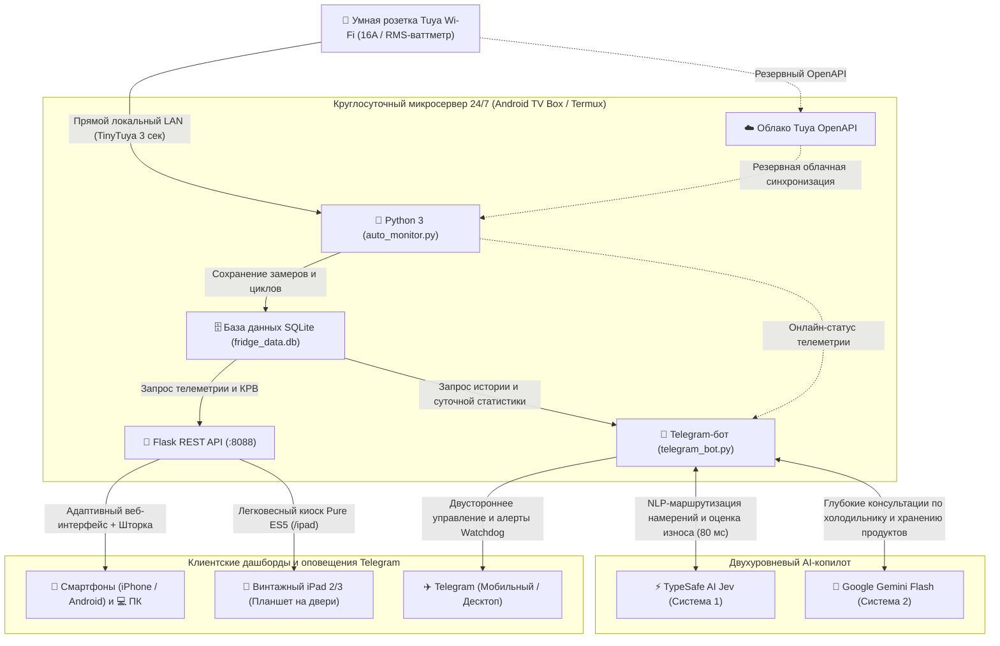

<div align="center">

# 🧊 SmartFridge-Telemetry-Kiosk
### Превратите любой классический холодильник в умный IoT-хаб за $0 с помощью ТВ-приставки на Android, умной розетки и старого iPad

<p align="center">
  <a href="README.md">English</a> • <b>Русский</b>
</p>

[](version.py)
[](https://www.python.org/)
[](https://flask.palletsprojects.com/)
[](https://sqlite.org/)
[-success.svg?logo=android)](https://termux.dev/)
[-orange.svg?logo=apple)](https://apple.com)
[-brightgreen.svg)](https://github.com/jasonacox/tinytuya)
[-blueviolet.svg)](https://typesafe.ai)
[](https://aistudio.google.com)
[](https://telegram.org)
[](https://alevoldon.github.io/SmartFridge-Telemetry-Kiosk/)
[](LICENSE)

<br />


*Старый iPad 3 2012 года (Retina Display, iOS 9.3.6, модель MD369KS/A) с ультралегким ES5-дашбордом, закрепленный прямо на двери холодильника и работающий от круглосуточного фонового микросервера на ТВ-приставке Android.*

</div>

---

## 📖 Обзор проекта

Когда мастер по ремонту заявляет, что компрессор вашего холодильника молотит без остановки из-за *«плохого напряжения в сети»*, не спорьте на словах — **аргументируйте телеметрией в реальном времени, термодинамикой и графиками.**

**SmartFridge-Telemetry-Kiosk** — это законченная автономная (self-hosted) IoT-экосистема телеметрии, созданная для постоянного мониторинга, глубокой диагностики и визуализации рабочих циклов холодильника в реальном времени. Система в реальном времени рассчитывает термодинамический коэффициент рабочего времени ($\text{КРВ} = \frac{T_{\text{охл}}}{T_{\text{охл}} + T_{\text{отд}}}$), безошибочно различает **охлаждение компрессором** и **электрооттайку No Frost ТЭНом**, а также выдерживает аварийные отключения электроэнергии (блэкауты) с бесшовным восстановлением данных.

### 🌟 Ключевые возможности

- 🏠 **Двухканальный опрос LAN Direct (0 затрат облачных квот):** Считывание датчиков умной розетки напрямую по локальной сети Wi-Fi (TinyTuya LAN UDP/TCP) каждые 3 секунды со **100% экономией облачных квот**. Переключение на Tuya Cloud OpenAPI происходит автоматически только при сбоях локального Wi-Fi.
- 🍏 **Вторая жизнь винтажного железа (Киоск на iPad):** Устаревшие планшеты (протестировано на **iPad 3 Retina iOS 9.3.6**, iPad 2, iPad 4, iPad mini 1–2), которые не способны открывать современные тяжелые фреймворки, запускают выделенный сверхбыстрый **интерфейс на чистом ES5 и табличном CSS3** (`/ipad`) без внешних библиотек и зависимостей.
- 🤖 **Автономный микросервер с потреблением 3 Вт:** Работает круглосуточно внутри **Termux на Android TV Box за $15 (H96 Max / Rockchip RK3318 / Amlogic)**, полностью заменяя дорогой и дефицитный Raspberry Pi.
- ⚡ **Детекция блэкаутов и аварийный режим киоска:** Мгновенно фиксирует пропадание напряжения в сети, переключая экраны в контрастный статус *«🔴 ЭЛЕКТРИЧЕСТВО ОТКЛЮЧЕНО (БЛЭКАУТ)»* с секундомером длительности отключения и экстренным оповещением в Telegram.
- 🌡️ **Теплофизическая модель тепловой инерции:** Расчет прогрева камер без физических термодатчиков во время отключений света ($+1.4^\circ\text{C/ч}$ в морозилке, $+0.8^\circ\text{C/ч}$ в холодильном отделении) и прогнозирование кривой выхода на режим при включении.
- 🔄 **Ежечасная аппаратная калибровка телеметрии:** Сверка локального интеграла энергии каждого цикла со специализированным чипом учета энергии умной розетки (регистр `add_ele` в Tuya Cloud) каждый час в `XX:05` с непрерывной автоподстройкой калибровочного коэффициента.
- 🛡️ **Антифриз сокетов (Socket Anti-Stall) и отказоустойчивость:** Обнаружение «залипших» аппаратных регистров счетчика при ровной нагрузке, фильтрация помех и просадок Wi-Fi, предотвращение дублирования или разрыва рабочих циклов.
- 🧠 **Двухуровневая экосистема искусственного интеллекта (TypeSafe AI + Google Gemini Flash):**
  - **Система 1 (TypeSafe AI Jev):** Мгновенная (~80 мс) детерминированная обработка естественного языка, оценка механического износа компрессора и термодинамического здоровья. Обеспечивает голосовые/текстовые ответы в Telegram (*«как там холодильник?», «закончил морозить?», «сколько нагорело за сегодня?»*) без малейшей нагрузки на слабый 3-ваттный процессор приставки.
  - **Система 2 (Google Gemini Flash):** Интеллектуальный консультант и инженер-холодильщик, обученный паспортным данным Samsung RT34MB и живой телеметрии с каскадным отказоустойчивым переключением между 5 моделями (`gemini-flash-lite-latest` $\to$ `gemini-3.6-flash`), отвечающий на любые вопросы в Telegram (*«почему боковые стенки горячие?», «сколько продуктов можно загружать?», «на какую полку положить сыр?»*).
- 🔔 **Мягкий музыкальный аудиомодуль:** Синтезированный двухтональный звуковой сигнал окончания цикла (`chime.wav` + WebAudio) с перманентной разблокировкой фонового воспроизведения в iOS Safari.
- 📱 **Мобильная панель и всплывающая шторка (Drawer):** Полностью адаптивный интерфейс под смартфоны с быстрым боковым меню, тестированием звука и фильтрацией строк таблицы.
- 🖨️ **Печать профессиональных отчетов в PDF:** Быстрая генерация черно-белого отчета для экономии чернил при печати с автоматическим скрытием элементов навигации.

---

## 🏗️ Архитектура системы



---

## 🔬 Термодинамический анализ работы холодильника

Система в реальном времени классифицирует состояние прибора по трем базовым режимам:

| Режим | Потребляемая мощность | Состояние узлов | Типичная длительность |
| :--- | :--- | :--- | :--- |
| **🟢 Охлаждение (компрессор)** | `125 – 185 Вт` | Работает электродвигатель компрессора + вентилятор испарителя | $20 \dots 40\text{ мин}$ |
| **⚪ Отдых (удержание холода)** | `0.0 Вт` | Все моторы остановлены, изоляция камеры удерживает температуру | $35 \dots 55\text{ мин}$ |
| **🔥 Оттайка No Frost (ТЭН)** | `160 – 175 Вт` | Компрессор выключен, трубчатый электронагреватель растапливает иней | $15 \dots 25\text{ мин}$ |

### Формула: Коэффициент рабочего времени (КРВ / Duty Cycle)
$$\text{КРВ (Duty Cycle)} = \frac{T_{\text{охл}}}{T_{\text{охл}} + T_{\text{отд}}}$$
- **Номинальный энергоэффективный диапазон:** $0.35 \le \text{КРВ} \le 0.50$
- **Повышенная нагрузка / загрузка теплых продуктов:** $0.50 < \text{КРВ} \le 0.75$
- **Предупреждение о неисправности / утечке хладагента:** $\text{КРВ} > 0.85$ (непрерывная работа компрессора без фазы отдыха)

---

## 📁 Структура каталогов проекта

```text
Samsung_RT34MB_Monitor/
│
├── 🚀 auto_monitor.py          # Основной фоновый телеметрический сервер 24/7
├── 🧮 fridge_logic.py          # Модуль чистой логики: классификатор, КРВ, LAN (покрыт unit-тестами)
├── 💬 telegram_bot.py          # Telegram-бот с двусторонним управлением на естественном языке
├── 🧠 typesafe_ai.py           # AI-копилот TypeSafe AI Jev (Система 1, без внешних зависимостей)
├── 🤖 gemini_ai.py             # Интеллектуальный консультант Google Gemini Flash (Система 2)
├── 🏷️ version.py              # Единый источник правды (SSOT) метаданных версии (v3.10.0 Pro)
├── 🧪 tests/                   # Набор модульных тестов (58 тестов, 100% успешное прохождение)
├── ⚙️ config.json              # Текущий рабочий конфигурационный файл и API-ключи
├── ⚙️ config.example.json      # Шаблон конфигурационного файла
├── 🌐 lan.env.example          # Шаблон привязки интерфейсов LAN/Ethernet для Android и Linux
├── 🗄️ fridge_data.db           # База данных SQLite (телеметрия, замеры, архивы циклов)
├── 📦 requirements.txt         # Зависимости Python
├── 📖 README.md, README.ru.md  # Документация проекта (EN / RU) и лицензия MIT
│
├── 📁 static/                  # Фронтенд и статические ресурсы веб-дашборда
│   ├── 📁 css/
│   │   └── dashboard.css       # Полные адаптивные стили, темная тема и анимации
│   ├── 📁 js/
│   │   ├── dashboard.js        # Ядро опроса телеметрии, звука и управления архивом
│   │   └── analytics.js        # Аналитика энергопотребления, графики и диагностика
│   ├── index.html              # Адаптивный дашборд (чистый HTML-каркас)
│   ├── ipad.html               # Киоск для старых iPad (чистый ES5 / CSS3)
│   ├── chime.wav               # Звуковой файл мягкого двухтонального колокольчика
│   ├── chart.umd.min.js        # Локальная библиотека Chart.js
│   ├── manifest.json           # Манифест автономного веб-приложения PWA
│   └── *.png, *.ico, *.jpg     # Иконки приложения и графические фоны
│
├── 📁 scripts/                 # Скрипты автоматизации и служебные утилиты
│   ├── bump_version.py         # Скрипт автоматического повышения версии проекта
│   ├── find_fridge.py          # Сканер и автопоиск умной розетки в локальной подсети
│   ├── generate_report.py      # Генератор текстового диагностического аудита
│   ├── h96_start_fridge.sh     # Демон автозапуска для Android TV Box
│   ├── h96_keep_eth_ip.sh      # Утилита фиксации статического IP-адреса сети
│   ├── start_monitor.bat       # Лаунчер для Windows
│   └── start_monitor.vbs       # Фоновый бесшумный запуск для Windows
│
├── 📁 docs/                    # Техническая документация и отчеты
│   ├── *.docx                  # Аудиторские отчеты и диагностические заключения
│   ├── *.md                    # История версий и технические заметки
│   └── *.jpg, *.txt            # Фотографии инсталляции и заметки
│
└── 📁 data_backups/            # Резервные копии базы данных SQLite
```

---

## 🚀 Руководство по быстрому старту

### 1. Аппаратные требования
1. **Умная Wi-Fi розетка с энергомониторингом:** Любая 16A розетка на платформе Tuya / Smart Life (например, BlitzWolf, Gosund, Aubess и аналогичные).
2. **Серверное устройство:**
   - ТВ-приставка на Android с установленным Termux (рекомендуется, энергопотребление ~3 Вт), ЛИБО
   - Raspberry Pi, любой мини-ПК или домашний компьютер на Windows/Linux.
3. **Дисплей (опционально):** Старый iPad 2/3/4 на магнитной ленте или подставке на дверце холодильника.

### 2. Установка

```bash
# Клонируйте репозиторий
git clone https://github.com/ALEVOLDON/SmartFridge-Telemetry-Kiosk.git
cd SmartFridge-Telemetry-Kiosk

# Установите зависимости
pip install -r requirements.txt

# Создайте рабочий файл конфигурации
cp config.example.json config.json
```

Отредактируйте `config.json`, указав свои данные доступа:
```json
{
    "api_region": "eu",
    "api_key": "ВАШ_TUYA_API_KEY",
    "api_secret": "ВАШ_TUYA_API_SECRET",
    "device_id": "ID_ВАШЕЙ_РОЗЕТКИ",
    "local_key": "LOCAL_KEY_ВАШЕЙ_РОЗЕТКИ",
    "lan_subnet": "192.168.0.0/24",
    "electricity_tariff": 1.94,
    "currency": "₽",
    "telegram_bot_token": "ТОКЕН_ВАШЕГО_ТЕЛЕГРАМ_БОТА",
    "telegram_chat_id": "ВАШ_CHAT_ID",
    "telegram_enabled": true,
    "typesafe_api_key": "ВАШ_TYPESAFE_API_KEY",
    "typesafe_enabled": true,
    "gemini_api_key": "ВАШ_GEMINI_API_KEY",
    "gemini_enabled": true,
    "gemini_model": "gemini-flash-lite-latest"
}
```

*Примечание: Интеграция с Google Gemini включает каскадный автоматический переход между 5 моделями (`gemini-flash-lite-latest` $\to$ `gemini-3.5-flash-lite` $\to$ `gemini-3.1-flash-lite` $\to$ `gemini-flash-latest` $\to$ `gemini-3.6-flash`) на случай исчерпания лимитов или недоступности отдельных эндпоинтов.*

На Android TV Box скопируйте `lan.env.example` в `lan.env`, если сетевой адрес Ethernet отличается от `192.168.0.103 / 192.168.0.0/24`. Запуск тестов выполняется командой: `python -m unittest discover -s tests -v`.

### 3. Запуск сервера

```bash
# Запуск автономного сервера
python auto_monitor.py
```

- **Основной дашборд:** `http://localhost:8088` (или `http://IP_ВАШЕГО_СЕРВЕРА:8088`)
- **Киоск для винтажных iPad:** `http://IP_ВАШЕГО_СЕРВЕРА:8088/ipad`

---

## 🤖 Круглосуточный запуск 24/7 на Android TV Box (Termux)

Для полностью автономной работы на Android TV Box без необходимости держать включенным компьютер:

```bash
# В терминале Termux на Android
pkg update && pkg install python git sqlite -y
pip install flask tinytuya requests

# Клонирование и запуск в фоновом режиме
git clone https://github.com/ALEVOLDON/SmartFridge-Telemetry-Kiosk.git
cd SmartFridge-Telemetry-Kiosk
termux-wake-lock
nohup python auto_monitor.py > /sdcard/monitor.log 2>&1 &
```

---

## 🍏 Настройка винтажного iPad (iOS 8 / 9 / 10 / 11 / 12)

1. Откройте стандартный браузер **Safari** на планшете.
2. Перейдите по адресу: `http://<IP_СЕРВЕРА>:8088/ipad`.
3. Нажмите кнопку **«Поделиться»** (Share) $\to$ **«На экран "Домой"»** (Add to Home Screen).
4. В Настройках iOS $\to$ «Экран и яркость» $\to$ «Автоблокировка» выберите **«Никогда»**.
5. Закрепите iPad на двери холодильника с помощью неодимовых магнитов, чехла-книжки или двусторонней магнитной ленты.

---

## 💬 Telegram-бот и умный сторожевой таймер (Watchdog)

В систему встроен полнофункциональный двусторонний Telegram-бот ([`telegram_bot.py`](telegram_bot.py)), работающий непосредственно на ТВ-приставке без использования тяжелых внешних библиотек. Он обеспечивает удаленное управление, мониторинг энергопотребления, своевременные аварийные оповещения и семейный доступ.

```text
┌──────────────────────────────────────────────┐
│  📱 Telegram Refrigerator Kiosk Control      │
├──────────────────────┬───────────────────────┤
│  🟢 Статус           │  📊 Отчёт за неделю   │
├──────────────────────┼───────────────────────┤
│  ⚡ За сегодня       │  ⚖️ Сверить счётчик   │
├──────────────────────┼───────────────────────┤
│  🧠 Аудит            │  ❓ Помощь            │
└──────────────────────┴───────────────────────┘
```

### 🎛️ Интерактивные команды и кнопки быстрого доступа

- **🟢 Статус (`/status`):** Мгновенная сводка текущего режима, мощности компрессора, напряжения сети, температурных зон и длительности активного цикла.
- **⚡ За сегодня (`/today`):** Суточное энергопотребление (кВт⋅ч), чистое время работы компрессора, КРВ и стоимость израсходованного электричества по вашему тарифу.
- **📊 Отчёт за неделю (`/weekly`):** Полный 7-дневный аудит: общий расход электроэнергии, затраты, средний КРВ, статистика оттаек и вердикт по состоянию компрессора.
- **⚖️ Сверить счётчик (`/reconcile`):** Принудительная сверка программной телеметрии с аппаратным счетчиком умной розетки (регистр `add_ele` в Tuya Cloud).
- **🧠 Аудит (`/audit`):** Оценка термодинамической эффективности и степени износа компрессора.
- **❓ Помощь (`/help`):** Справка по всем командам и экспресс-диагностика.

### 🚨 Сторожевой режим 24/7 (Watchdog Alerts)

- ⚡ **Мгновенные оповещения о блэкаутах:** Бот немедленно сообщает о пропадании сетевого питания, а после его включения отправляет сводный отчет с длительностью блэкаута и оценкой риска порчи продуктов.
- ⚠️ **Защита от просадки напряжения (< 185 В):** Предупреждает о критическом падении напряжения, опасном для пусковых обмоток компрессора.
- ⏱️ **Контроль затянутого цикла (> 60 мин):** Сигнализирует, если компрессор работает дольше обычного (неплотно закрытая дверь, износ уплотнителя или перегрузка теплыми продуктами).
- 📅 **Воскресный дайджест:** Автоматическая отправка сводного отчета за неделю каждое воскресенье в 20:00.

### 🧠 Двухуровневый искусственный интеллект в чате

- **Распознавание естественной речи (TypeSafe AI Jev):** Общайтесь с ботом обычными фразами на русском или английском (*«как дела?», «холодильник отдыхает?», «сколько нагорело за день?»*) — система автоматически распознает намерение и выполнит нужную команду.
- **Инженерный AI-эксперт (Google Gemini Flash):** Основываясь на реальной телеметрии и спецификациях Samsung RT34MB, отвечает на любые технические вопросы (*«почему боковые стенки горячие?», «какой предел загрузки морозилки?», «на какую полку положить скоропортящиеся продукты?»*).

### 🔒 Безопасность и белый список пользователей (Whitelist)

Бот принимает команды исключительно от доверенных идентификаторов `chat_id` и полностью игнорирует посторонние запросы. Для семейного доступа можно перечислить несколько ID через запятую:

```json
{
    "telegram_bot_token": "ВАШ_ТОКЕН_БОТА",
    "telegram_chat_id": "CHAT_ID_1, CHAT_ID_2",
    "telegram_enabled": true
}
```

---

## 📜 Лицензия

Проект распространяется под открытой лицензией [MIT](LICENSE).
Вы можете свободно использовать, модифицировать и адаптировать его под свои системы умного дома!
